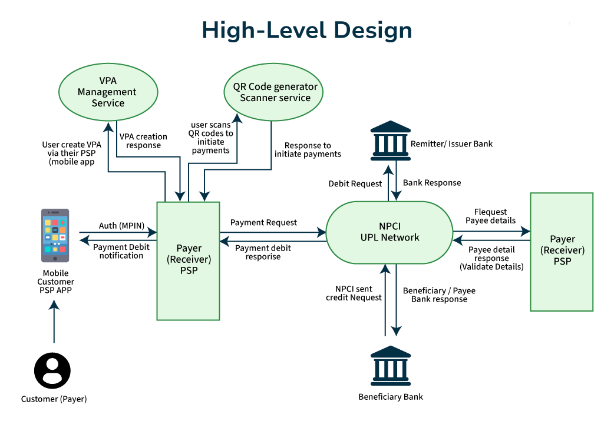

# 🚀 UPIGrid – Distributed UPI Payment Processing System

UPIGrid is a microservices-based system that simulates how UPI transactions flow between Payment Service Providers (PSPs), the central switch operated by NPCI, and beneficiary banks within the UPI ecosystem.

This models the complete transaction lifecycle, including request validation, routing through a central switch, debit and credit processing, and response propagation across independent services while maintaining consistent transaction states.

## 🏗️ High-Level Architecture

UPIGrid is designed around four core logical entities communicating securely to process a transaction lifecycle:

* **PSP Service (Payment Service Provider):** The user-facing gateway. It authenticates the user, validates balances, and initiates the payment request.
* **NPCI Switch (Central Router):** The central brain of the ecosystem. It receives requests from the PSP, validates the destination, and securely routes the transaction to the appropriate banks.
* **Bank A (Remitter Bank):** The sender's bank, responsible for verifying funds and safely processing the debit.
* **Bank B (Beneficiary Bank):** The receiver's bank, responsible for processing the credit and finalizing the ledger update.

### 🔁 The Transaction Flow

* **Initiation:** The user logs into the PSP app and initiates a transfer.
* **Routing:** The PSP validates the JWT and sends the request to the NPCI switch.
* **Settlement:** The NPCI routes the debit request to Bank A and the credit request to Bank B.
* **Confirmation:** Both banks process their respective ledger updates. The NPCI consolidates the status and propagates the final response back to the user via the PSP.

---

## 🧩 Microservices Ecosystem

The system is broken down into independent, modular services with strict separation of concerns.

| Component | Description | Repository |
| :--- | :--- | :--- |
| **PSP Service** | Handles user authentication, balance checks, and transaction initiation. | [View Repo](https://github.com/sabaneabhishek0110/UPISIM-PSP-Service) |
| **NPCI Service** | Central transaction switch and routing logic. | [View Repo](https://github.com/sabaneabhishek0110/UPISIM-NPCI-Service) |
| **Bank-A Service** | Manages debit/credit processing and ledger management. | [View Repo](https://github.com/sabaneabhishek0110/UPISIM-Bank-A-Service) |
| **Bank-B Service** | Manages debit/credit processing and ledger management. | [View Repo](https://github.com/sabaneabhishek0110/UPISIM-Bank-B-Service) |
| **Frontend** | React-based user interface for transaction initiation. | [View Repo](https://github.com/sabaneabhishek0110/UPISIM-Frontend) |

---

## ⚙️ Core System Capabilities

This project goes beyond basic CRUD operations, implementing advanced distributed system patterns to ensure transactional integrity and system reliability:

* **Distributed Architecture:** Independent microservices, each operating with its own isolated database schema.
* **Data Integrity:** Implements the Outbox Pattern to prevent data loss and maintains strict ACID guarantees across transaction tables.
* **Fault Tolerance:** Built-in failure handling, retry mechanisms, and idempotency support to handle service crashes gracefully.
* **Robust Security:** Secured via JWT-based authentication, HttpOnly secure cookies, role-based authorization, and protected service-to-service communication.

---

## 🛠️ Tech Stack & Deployment

* **Backend:** Java, Spring Boot, Spring Security, Spring Data JPA, RESTful APIs.
* **Frontend:** React.js, Zustand (State Management), React Router, Axios.
* **Database:** PostgreSQL (Independent schemas per service).
